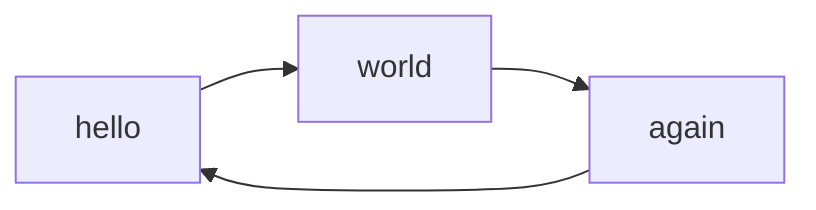

[](https://pypi.org/project/mkdocs-encryptcontent-plugin/)
[](https://pypi.org/project/mkdocs-encryptcontent-plugin/)
[](https://opensource.org/licenses/MIT)

# mkdocs-encryptcontent-plugin

This plugin allows you to have password protected articles and pages in MKdocs.

The content is encrypted with AES-256 in Python using PyCryptodome and decrypted in the browser with Crypto-JS or Webcrypto.

*It has been tested in Python Python 3.8+*

**Usecase**

> I want to be able to protect the content of the page with a password.
>
> Define a password to protect each page independently or a global password to protect them all.
>
> If a global password exists, all articles and pages are protected with this password.
>
> If a password is defined in an article or a page, it is always used even if there is a global password.
>
> If a password is defined as an empty character string, content encryption is disabled.
>
> Additionally password levels can be defined in mkdocs.yml or external yaml file with user/password credentials.

## Todos for 3.0.x

* ~~Rework password handling or inventory of some sort~~
* ~~Rework crypto (PBKDF2 + AES256)~~
* ~~Save the generated random keys instead of passwords to session storage (remember_keys)~~
* ~~Sign generated generated and javascript files used in encrypted pages to make it more tamper proof~~
* ~~Add urlencode for latin1 encoding in passwords, as it pycryptodome's implementation of PBKDF2 requires it~~
* ~~find an equivalent way to define multiple passwords in the password inventory as global password~~
* ~~make it possible to define passwords in external yaml file(s)~~
* ~~decrypt all possible keys by one login (replace path fallback)~~
* ~~optional replace crypto-js by webcrypto functions~~
* ~~localStorage option is rather useless now (being unsafe to start with). Fix it nevertheless by saving credentials instead of keys~~
* Update/Restructure documentation

## Todos for 3.1.x
* optional server side keystore (allows throtteling)
* ...to be defined


# Table of Contents
* [Installation](#Installation)
* [Usage](#Usage)
	* [Global password protection](#Global-password-protection)
		* [Password inventory](#Password-inventory)
		* [Secret from environment](#Secret-from-environment)
		* [Default vars customization](#Default-vars-customization)
		* [Translations](#Translations)
		* [Obfuscate pages](#Obfuscate-pages)
		* [Example plugin configuration](#Example-plugin-configuration)
* [Features](#Features)
	* [Override default templates](#Override-default-templates)
		* [Add button](#Add-button)
		* [Tag encrypted page](#Tag-encrypted-page)
		* [Remember password](#Remember-password)
	* [Modify generated pages](#Modify-generated-pages)
		* [Encrypt something](#Encrypt-something)
		* [Inject decrypt-form.tpl to theme](#Inject-decrypt-form.tpl-to-theme)
		* [Mix encrypted and normal content](#Mix-encrypted-and-normal-content)
	* [Search encryption](#Search-encryption)
		* [Search index encryption](#Search-index-encryption)
		* [Search index encryption for mkdocs-material](#Search-index-encryption-for-mkdocs-material)
	* [Javascript extensions](#Javascript-extensions)
		* [Reload user-defined scripts](#Reload-user-defined-scripts)
		* [HighlightJS support](#HighlightJS-support)
		* [Arithmatex support](#Arithmatex-support)
		* [Mermaid2 support](#Mermaid2-support)
	* [Security](#Security)
		* [Crypto-js or webcrypto?](#Crypto-js-or-webcrypto?)
		* [File name obfuscation](#File-name-obfuscation)
		* [Signing of generated files](#Signing-of-generated-files)


# Installation

Install the package with pip:

```bash
pip install mkdocs-encryptcontent-plugin
```

Install the package from source with pip:

```bash
cd mkdocs-encryptcontent-plugin/
python setup.py sdist bdist_wheel
pip install --force-reinstall --no-deps dist/mkdocs_encryptcontent_plugin-3.0.0.dev3-py3-none-any.whl
```

Enable the plugin in your `mkdocs.yml`:

```yaml
plugins:
    - search: {}
    - encryptcontent: {}
```
> **NOTE:** If you have no `plugins` entry in your configuration file yet, you'll likely also want to add the `search` plugin.
> MkDocs enables it by default if there is no `plugins` entry set, but now you have to enable it explicitly.

# Usage

Add an meta tag `password: secret password` in your markdown files to protect them.

Alternatively add the meta tag `level: secret` to use one or more secrets defined at the
plugin's `password_inventory` or `password_file` in your "mkdocs.yml".


### Global password protection

Add `global_password: your_password` in plugin configuration variable, to protect all pages with this password by default

```yaml
plugins:
    - encryptcontent:
        global_password: 'your_password'
```

If the password meta tag is defined in a markdown file, it will **ALWAYS** override the global password. 

> **NOTE** Keep in mind that if the `password:` tag exists without value in a page, it will **not be protected** !
> Use this to **disable** `global_password` on specific pages.


### Password inventory

With the `password_inventory` you can define protection levels (assigned with the meta tag `level` in markdown files).

```yaml
plugins:
    - encryptcontent:
        password_inventory:
          classified: 'password1'
          confidential:
            - 'password2'
            - 'password3'
          secret:
            user4: 'password4'
            user5: 'password5'
```

These levels may be only one password (f.ex. classified), a list of multiple passwords (f.ex. confidential)
or multiple username/password pairs (f.ex. secret).
It is possible to reuse credentials at different levels.

>Note that a "list of multiple passwords" comes with a downside: All entries may be tested because unlike "user/password pairs"
>there is no hint to determine the distinct entry to try
>(At least I found no hint that wouldn't make it easier for a brute force attacker).
>This means, that a high `kdf_pow` could cause long waiting time even if the right password was entered.

The plugin will generate one secret key for each level, which is then used to encrypt the assigned sites.


#### Password inventory in external file

You can define password levels in an external yaml file and link it with `password_file`.
The intention is to separate sensitive information from configuration options.

```yaml
plugins:
    - encryptcontent:
        password_file: 'passwords.yml'
```

passwords.yml:
```yaml
classified: 'password1'
confidential:
    - 'password2'
    - 'password3'
secret:
    user4: 'password4'
    user5: 'password5'
```


#### Global password(s) in inventory

You can add the special level `_global`, which will be applied globally on all sites like this:

```yaml
plugins:
    - encryptcontent:
        password_inventory:
            _global: 'either define one password'
            _global:
                - 'or define'
                - 'multiple passwords'
            _global:
                user1: 'or use user'
                user2: 'and password pairs'
```

> **NOTE** Add the meta tag `level:` (without a value) to pages which should be excluded from global password level.
> Also note that it is always possible to set the page to a different level than the global one with the `level` meta tag.

### Secret from environment

It is possible to read values from environment variable 
(as discribed [here](https://www.mkdocs.org/user-guide/configuration/#environment-variables)).
This replaces the deprecated `use_secret` option from previous versions.

```yaml
plugins:
    - encryptcontent:
        password_inventory:
            secret:
                user1: !ENV PASSWORD1_FROM_ENV
                user2: !ENV [PASSWORD2_FROM_ENV, 'Password if PASSWORD2_FROM_ENV undefined or empty']
                user3: !ENV [PASSWORD3_FROM_ENV, FALLBACK_PASSWORD3_FROM_ENV, 'Password if neither PASSWORD3_FROM_ENV nor FALLBACK_PASSWORD3_FROM_ENV defined']
```

### Default vars customization

Optionally you can use some extra variables in plugin configuration to customize default strings.

```yaml
plugins:
    - encryptcontent:
        title_prefix: '[LOCK]'
        summary: 'another informational message to encrypted content'
        placeholder: 'another password placeholder'
        decryption_failure_message: 'another informational message when decryption fails'
        encryption_info_message: "another information message when you don't have access !"
        input_class: 'md-search__form md-search__input'
        button_class: 'md-search__icon'
```

Default prefix title is `[Protected]`.

Default summary message is `This content is protected with AES encryption.`.

Default password palceholder is `Provide password and press ENTER`.

Default decryption failure message is `Invalid password.`.

Defaut encryption information message is `Contact your administrator for access to this page.`.

> **NOTE** Adding a prefix to the title does not change the default navigation path !

### Translations

If the plugin is used in conjunction with the [static-i18n](https://ultrabug.github.io/mkdocs-static-i18n/) 
plugin you can provide `translations` for the used `i18n_page_locale`.

```yaml
    - encryptcontent:
        #...
        translations:
          de:
            title_prefix: '[Verschlüsselt] '
            summary: 'Der Inhalt dieser Seite ist mit AES verschlüsselt. '
            placeholder: 'Mit Strg+Enter wird das Passwort global gesetzt'
            password_button_text: 'Entschlüsseln'
            decryption_failure_message: 'Falsches passwort.'
            encryption_info_message: 'Bitte wenden Sie sich an den Systemadministrator um auf diese Seite zuzugreifen.'
```

#### Custom per-page strings

You can set the  meta tag `encryption_summary` to customize `summary` and `encryption_info_message` on every page.

### Obfuscate pages

If you want to make it harder for search engines to scrape you pages content,
you can set `obfuscate: SomeNotSoSecretPassword` meta tag in markdown.

The page then will display `summary` and `encryption_info_message` together with a button labeled with
`password_button_text`. In order to view the pages content one hast to press the button first.

If a `password` or `level` is set, then the `obfuscate` feature will be disabled.
If you want to use `obfuscate` in a configuration where `global_password` or `_global` level is defined, 
you'll need to set the `password:` or rather `level:` meta tag (with no password/level defined) to undefine the password on this page.

The keys to all obfuscated pages are also saved in every keystore, so they are decrypted if someone entered
correct credentials.


### Example plugin configuration

```yaml
plugins:
    - encryptcontent:
        title_prefix: ''
        summary: ''
        placeholder: 'Password'
        placeholder_user: User
        password_button_text: 'ENTER'
        decryption_failure_message: 'Wrong user name or password.'
        encryption_info_message: 'Legitimation required.'
        translations:
          de:
            title_prefix: ''
            summary: ''
            placeholder: 'Passwort'
            placeholder_user: Benutzer
            password_button_text: 'ENTER'
            decryption_failure_message: 'Falscher Benutzer oder Passwort.'
            encryption_info_message: 'Legitimation erforderlich.'
        html_template_path: "decrypt-form.tpl.html" # override default html template
        password_button: True
        input_class: 'w3-input' # CSS class used for input username and password
        button_class: 'w3-button w3-theme-l1 w3-hover-theme' # CSS class for password_button
        hljs: False
        arithmatex: False
        mermaid2: False
        remember_keys: true # keys from keystore will temporarily saved to sessionStorage
        remember_password: false # the entered credentials are not saved
        remember_prefix: encryptcontent_plugin_ # use different prefixes if other sites are running on the same domain
        encrypted_something: # additionally encrypt some html elements
          #myNav: [div, id]
          myToc: [div, id]
          myTocButton: [div, id]
        search_index: 'dynamically' # dynamically encrypt mkdocs search index 
        webcrypto: true # use browsers webcrypto support
        #selfhost: true # use self-hosted crypto-js
        #selfhost_download: true # download crypt-js for self-hosting
        #selfhost_dir: 'theme_override' # where to download crypto-js
        #reload_scripts:
        #  - '#theme'
        password_file: 'passwords.yml' # file with password inventory
        #kdf_pow: 4 # default for crypto-js: 4, default for webcrypto: 5
        sign_files: 'encryptcontent-plugin.json' # save ed25519 signatures here
        #hash_filenames: # add hash to file names of assets (to make them impossible to guess
        #  extensions:
        #    - 'png'
        #    - 'jpg'
        #    - 'jpeg'
        #    - 'svg'
        #  except:
        #    - 'logo.svg'
```

title: Features

# Features

### Override default templates

Related to [issue #32](https://github.com/unverbuggt/mkdocs-encryptcontent-plugin/issues/32)

You can override the default templates with your own templates by providing an actual replacement
path in the `html_template_path` *(HTML)* and `js_template_path` *(JS)* directives. 
Overridden templates **completely** replace the default templates. You **must** therefore copy the
default templates as a starting point to keep this plugin working.

```yaml
plugins:
    - encryptcontent:
        html_template_path: "/root/real/path/mkdocs_poc/my_html_template.html"
        js_template_path: "/root/real/path/mkdocs_poc/my_js_template.js"
        form_class: 'md-content__inner md-typeset'
        input_class: 'md-input'
        button_class: 'md-button md-button--primary'
```

Use `form_class`, `input_class` and `button_class` to optionally set a CSS class for the password input field and the button.

When overriding the default templates, you can add and use your own Jinja variables
and enrich your template, by defining `html_extra_vars` and `js_extra_vars` directives in key/value format.
Added values can be used in your Jinja templates via the variable `extra`.

```yaml
plugins:
    - encryptcontent:
        html_extra_vars:
            my_extra: "extra value"
            <key>: <value>
        js_extra_vars:
            my_extra: "extra value"
            <key>: <value>
```

For example, you can modify your HTML template, to add a new title with your own text variable.

```jinja
[ ... ] 
<h2>{{ extra.my_extra }}</h2>
[ ... ]
```

> **NOTE** Issues related to template override will not be addressed.

### Add button

Add `password_button: True` in plugin configuration variable, to add a button to the right of the password field.

When enabled, it allows to decrypt the content just like the classic keypress ENTER.

Optionally, you can add `password_button_text: 'custom_text_button'` to customize the button text.
 
```yaml
plugins:
    - encryptcontent:
        password_button: True
        password_button_text: 'custom_text_button'
```

### Tag encrypted page

> **Enable by default**

Related to [issue #7](https://github.com/unverbuggt/mkdocs-encryptcontent-plugin/issues/7)

This feature adds an additional attribute `encrypted` with value `True` to the mkdocs type `mkdocs.nav.page` object.

You can add `tag_encrypted_page: False` in plugin configuration, to disable tagging of encrypted pages. 

When enabled, it is possible to use the `encrypted` attribute in the jinja template of your theme, as a condition to perform custom modification.

```jinja

    
        <!-- Do something --> 
    

```

For example, you can use conditional check to add a custom class:

```jinja
<a class="mkdocs-encrypted-class"href="{{ nav_item.url|url }}">{{ nav_item.title }}</a>
```

### Remember password

Related to [issue #6](https://github.com/unverbuggt/mkdocs-encryptcontent-plugin/issues/6)

By default the plugin will save the decrypted AES keys to session storage of the browser (can be disabled by setting `remember_keys: False`).
This is enabled for convenience, so you are able to browse between multiple encrypted pages without having to re-enter the password.

Additionally it is possible to save the entered user/password in session storage (setting `remember_password: True`). Use this for
additional convenience during `mkdocs serve`, because the AES key are regenerated every time MkDocs starts
(rendering the old ones invalid and requiring to re-enter a valid credential again).

To avoid problems when multiple sites are hosted within the same domain, it is possible to customize the name of
the keys saved to storage with `remember_prefix`.

> **This feature is not really secure !** decryption keys are store in clear text inside session storage.
>
> Instead of using these features, I recommend to use a password manager with its browser plugin.
> For example **KeepassXC** allows you to detect the password field
> `mkdocs-content-password` and fill it automatically in a much more secure way.

It is also possible to save the used credentials permanently to local storage (setting `session_storage: False`), but
this should only be done for testing purposes. The local storage of a browser is most likely readable
for every other process that can access the file system. 

The session storage however should only be located in memory and be forgotten after the browser tab is closed.

```yaml
plugins:
    - encryptcontent:
        remember_keys : True
        remember_password: False
        remember_prefix: secretsite_
```

title: Modify pages

## Modify generated pages

### Encrypt something

Related to [issue #9](https://github.com/unverbuggt/mkdocs-encryptcontent-plugin/issues/9)

Add `encrypted_something: {}` in the plugin configuration variable, to encrypt something else on the page.

The syntax of this new variable **MUST** follow the yaml format of a dictionary. 
Child elements of `encrypted_something` are build with a key `<unique name>` in string format and a list as value.
The list has to be constructed with the name of an HTML tag `<html tag>` as first item
and `id` or `class` as the second item.

```yaml
plugins:
    - encryptcontent:
        encrypted_something:
            <uniqe name>: [<html tag>, <'class' or 'id'>]
```

The `<unique name>` key identifies the name of a specific element of the page that will be
searched by Beautiful Soup.
The first value of the list (`<html tag>`) identifies the type of HTML tag in which the name is present.
The second value of the list (`'id'` or `'class'`) specifies the type of the attribute which contains
the unique name in the html tag.

Prefer to use an `'id'`, however depending on the template of your theme, it is not always possible to use the id.
So we can use the class attribute to define your unique name inside the html tag. 
Beautiful Soup will encrypt all HTML elements discovered with the class.

When the feature is enabled every element is decrypted upon successfull content decryption on the page.

> Use this to hide the table of contents on the page or sub pages in the menu

By default **every child item** are encrypted and the encrypted elements have set
`style="display:none;"` to hide their content.

#### How to use it?! Examples

You can use the `page.encrypted` tag to add attributes to html tags in the HTML templates of your theme
or identify usable tag ids or classes that are already in the theme.

Then add these elements in the format of a yaml dictionary under the variable `encrypted_something`.

1. For example, encrypt ToC in a theme where ToC is under 'div' element like this :

```jinja
<div class=".." id="mkdocs-encrypted-toc">
    <ul class="..">
        <li class=".."><a href="{{ toc_item.url }}">{{ toc_item.title }}</a></li>
        <li><a href="{{ toc_item.url }}">{{ toc_item.title }}</a></li>
    </ul>
</div>
```

Set your configuration like this : 

```yaml
plugins:
    - encryptcontent:
        encrypted_something:
            mkdocs-encrypted-toc: [div, id]
```

2. Other example, with multiple targets. You are using a custom version of Material theme and
want to encrypt ToC content and Footer.

Material generates 2 `<nav>` structures with the same template `toc.html`, so you need to use a `class`
instead of an id for this part.
The footer part, is generated by the `footer.html` template in a classic div so an `id` is sufficient

After modification, your template looks like this :

toc.html:
```jinja
<nav class="md-nav md-nav--secondary mkdocs-encrypted-toc" aria-label="{{ lang.t('toc.title') }}">
    <label class="md-nav__title" for="__toc"> ... </label>
    <ul class="md-nav__list" data-md-scrollfix> ... </ul>
</nav>
```
footer.html:
```jinja
<footer class="md-footer">
    <div class="md-footer-nav" id="mkdocs-encrypted-footer"> ... </div>
    <div class="md-footer-meta md-typeset" id="mkdocs-encrypted-footer-meta">
</footer>
```

Your configuration would look like this :
```yaml
plugins:
    - encryptcontent:
        encrypted_something:
            mkdocs-encrypted-toc: [nav, class]
            mkdocs-encrypted-footer: [div, id]
            mkdocs-encrypted-footer-meta: [div, id]
```

3. If you are using unmodified mkdocs-material, then this example will encrypt menu, toc and footer
But you'd need the Navigation pruning feature to hide the title of encrypted pages from navigation (or see 2.).

```yaml
plugins:
    - encryptcontent:
        encrypted_something:
            md-footer__inner: [nav, class]
            md-nav: [nav, class]
```

### Inject decrypt-form.tpl to theme

Some themes or plugins might interfere with the way this plugin encrypts the content of a page.
In this case this feature will find and encrypt a unique tag in the same way as `encrypted_something`
does and additionally inject its `decrypt-form.tpl.html` in front of it.

```yaml
plugins:
    - encryptcontent:
        inject:
            <uniq name>: [<html tag>, <'class' or 'id'>]
```

This is an example for mkdocs-material:
```yaml
plugins:
  - blog
  - encryptcontent:
        encrypted_something:
            md-footer__inner: [nav, class] #Footer
            md-nav: [nav, class] #Menu and toc
        inject:
            md-content: [div, class]
```

> This feature overrides the normal practice of replacing the rendered content of a page.

### Mix encrypted and normal content

It is possible to only encrypt parts of the page and also to remove parts on successful decryption.

First install PyMdown Extensions by entering `pip install --upgrade pymdown-extensions`,
then enable them in your `mkdocs.yml`:
```yaml
markdown_extensions:
    - pymdownx.blocks.html
```

This is an example of a mixed markdown page:

```
title: This page mixes encrypted and normal content
level: secret
inject_id: protected
delete_id: teaser

/// html | div#teaser
## Teaser

You won't believe which secrets this page will unveil.
Find out more after you enter the correct password...
///

/// html | div#protected
## Secret

Well, the princess is another castle.
///
```

The markdown extension enables us to wrap a div tag around content by `/// html | div#some-id`.
It ends with `///`. The meta tag `inject_id` defines which div id we would like to encrypt
(it also injects the decryption form here). And the div id found at `delete_id` will be deleted
on successful decryption.

title: Search encryption

## Search encryption

### Search index encryption

> **Default value is "encrypted"**

Related to [issue #13](https://github.com/CoinK0in/mkdocs-encryptcontent-plugin/issues/13)

> :warning: **The configuration mode "clear" of this functionality can cause DATA LEAK**
>
> The unencrypted content of each page is accessible through the search index.
> Not encrypting the search index means completely removing the protection provided by this plugin.
> You have been warned 

This feature allows you to control the behavior of the encryption plugin with the search index. 
Three configuration modes are possible:

 * **clear** : Search index is not encrypted. Search is possible even on protected pages.
 * **dynamically** : Search index is encrypted on build. Search is possible once the pages have been decrypted.
 * **encrypted** : Search index of encrypted pages is removed on build. Search is not possible on encrypted pages.

You can set `search_index: '<mode_name>'` in your `mkdocs.yml` to change the search index encryption mode. Possible values are `clear`, `dynamically`, `encrypted`. The default mode is "**encrypted**".

```yaml
plugins:
    - encryptcontent:
        search_index: 'dynamically'
```

This functionality modifies the search index created by the “search” plug-in.
Some themes might override the default search plug-in provided by mkdocs, 
but so far the structure of the `search/search_index.json` file is consistent.

> The modification of the search index is carried out last (if `encryptcontent` is also last in `plugins`).
> But always double-check the generated index after `mkdocs build` to see if your information is protected.

When the configuration mode is set to "**dynamically**", the 
[javascripts contribution files](https://github.com/unverbuggt/mkdocs-encryptcontent-plugin/tree/master/encryptcontent/contrib/templates/search)
are used to override the default search plugin files provided by MkDocs. 
They include a process of decrypting and keeping the search index in a SessionStorage.

### Search index encryption for mkdocs-material

[Material for MkDocs](https://squidfunk.github.io/mkdocs-material/) uses a different search plugin that
cannot "easily" be overridden like the default search plugin.
However this Plugin will still remove encrypted pages (`encrypted`) or encrypt the search entries (`dynamically`)
for `mkdocs-material`.

In order to be able to decrypt the search index (`dynamically`) `mkdocs-material` needs to be customized (patched).

You'll need some [prerequisites](https://squidfunk.github.io/mkdocs-material/customization/#environment-setup)
and also execute these commands:

```bash
git clone https://github.com/squidfunk/mkdocs-material
cd mkdocs-material
pip install mkdocs-minify-plugin
pip install mkdocs-redirects
npm install

#copy material_search_worker.patch to mkdocs-material
patch -p 0 < material_search_worker.patch

pip install --force-reinstall .
#pip install --force-reinstall --no-deps . #faster if mkdocs-material was already installed
```

> Note: this currently doesn't work with mkdocs-material-9.x.x

title: Javascript extensions

## Javascript extensions

### Reload user-defined scripts

Related to [issue #14](https://github.com/unverbuggt/mkdocs-encryptcontent-plugin/issues/14)

You can set `reload_scripts:` in your `mkdocs.yml` with list of script sources
or script ids, to reload and execute some js lib after decryption process.

```yaml
plugins:
    - encryptcontent:
        reload_scripts:
            - 'js/example.js'
            - '#autoexec'
```

It is also possible to reload a script id like `<script id="autoexec">console.log('test');</script>`
that was encrypted within the page
(related to [issue #30](https://github.com/unverbuggt/mkdocs-encryptcontent-plugin/issues/30)).


### HighlightJS support

> **Enable by default**

If HighlightJS module is detected in your theme to improve code color rendering, reload renderer after
decryption process.
If HighlightJS module is not correctly detected, you can force the detection by adding `hljs: True`
on the plugin configuration
or set `hljs: False` to disable this feature.

When enabled the following part of the template is added to force reloading decrypted content.

```jinja

document.getElementById("mkdocs-decrypted-content").querySelectorAll('pre code').forEach((block) => {
    hljs.highlightElement(block);
});

```


### Arithmatex support

> **Enable by default**

Related to [issue #12](https://github.com/unverbuggt/mkdocs-encryptcontent-plugin/issues/12)

If Arithmatex markdown extension is detected in your markdown extensions to improve math equations rendering,
reload renderer after decryption process.
If the Arithmatex markdown extension is not correctly detected, you can force the detection by adding
`arithmatex: True` on the plugin configuration
or set `arithmatex: False` to disable this feature.
 
When enabled, the following part of the template is added to force math equations rendering on decrypted content.

```jinja

MathJax.typesetPromise()

```

> **NOTE** It has been tested in Arithmatex `generic` mode only. 


### Mermaid2 support

> **Enable by default**

Related to [issue #22](https://github.com/unverbuggt/mkdocs-encryptcontent-plugin/issues/22)

If mermaid2 plugin is detected in your configuration to generate graph from text, reload renderer after
decryption process.
If the Mermaid2 plugin is not correctly detected, you can force the detection by adding `mermaid2: True`
on the plugin configuration
or set `mermaid2: False` to disable this feature.
 
When enabled, the following part of the template is added to force graph rendering on decrypted content.

```jinja

mermaid.contentLoaded();

```

> **NOTE** it currently only works with mermaid version < 10. Also encryptcontent needs to be injected,
> because the mermaid2 plugin otherwise won't detect the page content correctly.

activate the plugin like this:

```yaml
plugins:
    - mermaid2:
        version: 9.4.3

markdown_extensions:
    - pymdownx.blocks.html
```

Example usage:

````
password: 1234
inject_id: inject


/// html | div#inject



///
````


title: Security

## Security

### Crypto-js or webcrypto?

By default the plugin uses the crypto-js library for page decryption, but using
the browser's built-in webcrypto engine is also possible (set `webcrypto: True`).

The main advantage of webcrypto over crypto-js is that it is much faster, allowing higher
calculation difficulty for key derivation (`kdf_pow`). Also it may be easier to implement
key derivation functions other than PBKDF2 with webcrypto in the future.

On the other hand crypto-js is implemented in pure Javascript without dependencies and well
tested (but it probably won't receive any updates as development stalled in 2021)
and we know nothing about how good or bad webcrypto is implemented in different browsers.

#### Self-host crypto-js

If you enable `selfhost` then you'll choose to upload crypto-js to your web server rather than using cloudflare CDN.
The self-host location is "SITE_URL/assets/javascripts/cryptojs/".

Additionally if you set `selfhost_download` then the required files will be automatically downloaded if needed.
The files are checked for their MD5 hash and saved to `docs_dir` or `selfhost_dir` (relative to `mkdocs.yml`).

```yaml
plugins:
    - encryptcontent:
        selfhost: True
        selfhost_download: False
        selfhost_dir: 'theme_overrides'
```

### File name obfuscation

Imagine your pages contain many images and you labeled them "1.jpg", "2.jpg" and so on for some reason.
If you'd like to encrypt one of these pages, an attacker could try guessing the image file names
and would be able to download them despite not having the password to the page.

This feature should make it impossible or at least way harder for an external attacker to guess the file names.
Please also check and disable directory listing for that matter.
Keep in mind that your hosting provider is still able to see all your images and files.

To counter file name guessing you could active the feature like this:

```yaml
plugins:
    - encryptcontent:
        selfhost: true
        selfhost_download: false
        hash_filenames:
          extensions:
            - 'png'
            - 'jpg'
            - 'jpeg'
            - 'svg'
          except:
            - 'lilien.svg'
```

At `extensions` we define which file name extensions to obfuscate
(extension is taken from the part after the last ".",
so the extension of "image.jpg" is "jpg" and of "archive.tar.gz" is "gz").

You can define multiple exceptions at the `except` list.
The file names that end with these strings will be skipped.
You should use this if some images are used by themes or other plugins.
Otherwise, you'd need to change these file names to the obfuscated ones.

The file names are obfuscated in a way that the corresponding file is hashed with MD5
and the hash is added to the file name
(If the file content is not changed the file name remains the same), like this:

some_image_1_bb80db433751833b8f8b4ad23767c0fc.jpg
("bb80db433751833b8f8b4ad23767c0fc" being the MD5 hash of said image.)

> The file name obfuscation is currently applied to the whole site - not just the encrypted pages...

### Signing of generated files

An attacker would most likely have a hard time brute forcing your encrypted content, given a good
password entropy. It would be much easier for him to fish for passwords by modifying the
generated pages, if he is able to hack your web space.

This feature will sign all encrypted pages and used javascript files with Ed25519. It will also generate
an example [canary script](https://en.wikipedia.org/wiki/Domestic_canary#Miner's_canary), which can be
customized to alert if files were modified.

> **NOTE** If Mkdocs is running with `mkdocs serve`, then signature verification of encrypted pages
> will fail, because the files are modified by Mkdocs to enable live reload.

```yaml
      sign_files: 'signatures.json'
      sign_key: 'encryptcontent.key' #optional
      canary_template_path: '/path/to/canary.tpl.py' #optional
```

First an Ed25519 private key is generated at "encryptcontent.key" (besides `mkdocs.yml`), however you can supply an
existing private key as long as it's in PEM format.

After generation the signatures are saved to "signatures.json" in `site_dir`, so this file also needs to be uploaded
to the web space. The canary script will download this file and compare the URLs to its own list and then download
all files and verify the signatures.

As long as the private key used for signing remains secret, the canary script will be able to determine
if someone tampered with the files on the server. But you should run the canary script from another machine
that is not related to the server, otherwise the attacker could also modify the canary script and sign with his
private key instead.