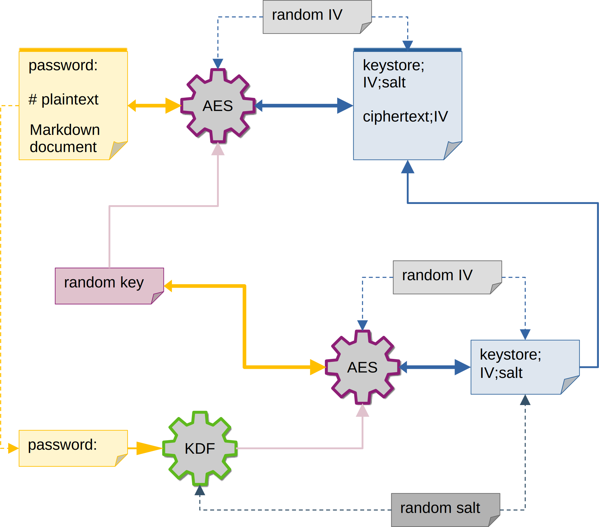

# How does this work?

For every `password` and for every `level` we generate a random 256 bit key.
This key will be used for AES-256 encryption on every page with the same `password` or same `level`.
Optionally search entries and [encrypt something](#encrypt-something)<!--todo--> on that page are also encrypted with the same key.

This random secret key (needed for deciphering the pages content) is then encrypted to a keystore with another key that is derived from
the defined credentials (a password or a username/password pair).
If the credential is reused on another `level`, then its random key is also encrypted in the same keystore.
The function to derive the key to the keystore (PBKDF2) can be adjusted in calculation cycles
to hopefully throttle the number of passwords a brute force attacker is able to try per second.

#### AES

Is a symmetric encryption algorithm. Symmetric means it uses the same secret key for encryption and decryption.
The size of the secret keys used in this plugin is 256 Bit (or 32 Bytes).\
Additionally a random (16 Bytes) initialization vector (called IV) is used (and added to the cyphertext)
to make sure the same plaintext will always result in a different cyphertext even if the same secret key is used
for encryption.

#### KDF

A **K**ey **D**erivation **F**unction a one-way key generation algorithm,
so it is not possible to reverse the function to retrieve a lost password.\
The password is salted, meaning if two people used the same password it would lead to different keys (similar to IV in AES).\
It is equipped with adjustable difficulty `kdf_pow`. The difficulty has significant weight on the build time and also
the time needed to decrypt a page, so it shouldn't be increased to any value.\
The algorithm used (PBKDF2) is not really state-of-the-art, meaning compared to better alternatives like bcrypt, scrypt or argon2
it is easier to crack with hardware acceleration, however it is supported in both crypto-js and webcrypto and
is significantly better than MD5 (which was used on all versions prior to 3.x) for key derivation.\
The secret key derived from PBKDF2 is used to decrypt the keystore containing different keys to decrypt the content.

# A word on password strength

The strength of a password can be measured in entropy or "possibilities to try" (for a brute force attacker).

\[
S = C^{L} * T
\]

**S** is the time it takes to try all possibilities (on average a password is found after trying half the possibilities),
**C** being the number of different characters the password is made of, **L** being the length of the password
and **T** the time it takes to try one password.

For example take a tree character password with just lower case letters like "abc".  
The number of lower case letters is 26, so a three character password leads to 26 * 26 * 26 = 17 576 possibilities to try.

Now take a three character password which also includes upper case letters like "aBc".  
The number of possibilities per character doubles to 52, so the three character password leads to 52 * 52 * 52 = 140 608 possibilities.
So compared to "abc" we got **eight times** more entropy in this case.

So what happens if we add one character and still only use lower case letters, like "abcd"?  
It's 26^4 = 456 976 with a four character password, that's **26 times** more entropy compared to only using three lower case characters.

It's easier to get higher entropy by increasing password size, than with adding more different characters or symbols.
An attacker could also have watched (or heard) you type the password (paying attention to the use of the shift key,
space bar or numeric keypad) and this way cross out character that you couldn't possibly have used.

So, to put it mildly: Every web page that forces you to use at least lower/upper case AND a number AND a symbol,
BUT only forces you to use eight characters of password size is not steering you to the right measures to gain entropy.

But, to be fair: A web page can take measures to seriously throttle the passwords try-able per second on the server side
or f.ex. use captchas after the third failed try. Although there were and most likely will be bad or failed examples of those measures.

This Mkdocs plugin can currently only take additional counter-measures to brute force attacks in form of PBKDF2.
PBKDF2 itself is more or less obsolete, because it got no defense against being run in parallel, so we should
consider it to not having a big effect on **T**.
Other options like bcrypt, scrypt od argon2 exist, but pbkdf2 is the only option
currently available in crypto-js and webcrypto. However there may be limitations that render the other option impractical,
like logner build times and high computing or memory requirements on mobile devices.
So you should really be interested in choosing a **long** password or pass phrases
(read the [Diceware article on Wikipedia](https://en.wikipedia.org/wiki/Diceware), [xkcd webcomic on password strength](https://xkcd.com/936/)
and [this blogpost](https://blog.benpri.me/blog/2019/01/13/why-you-shouldnt-be-using-bcrypt-and-scrypt/)).

