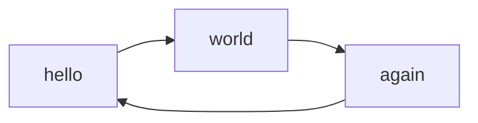

## Javascript extensions

### Reload user-defined scripts

Related to [issue #14](https://github.com/unverbuggt/mkdocs-encryptcontent-plugin/issues/14)

You can set `reload_scripts:` in your `mkdocs.yml` with list of script sources
or script ids, to reload and execute some js lib after decryption process.

```yaml
plugins:
    - encryptcontent:
        reload_scripts:
            - 'js/example.js'
            - '#autoexec'
```

It is also possible to reload a script id like `<script id="autoexec">console.log('test');</script>`
that was encrypted within the page
(related to [issue #30](https://github.com/unverbuggt/mkdocs-encryptcontent-plugin/issues/30)).


### HighlightJS support

> **Enable by default**

If HighlightJS module is detected in your theme to improve code color rendering, reload renderer after
decryption process.
If HighlightJS module is not correctly detected, you can force the detection by adding `hljs: True`
on the plugin configuration
or set `hljs: False` to disable this feature.

When enabled the following part of the template is added to force reloading decrypted content.

```jinja

document.getElementById("mkdocs-decrypted-content").querySelectorAll('pre code').forEach((block) => {
    hljs.highlightElement(block);
});

```


### Arithmatex support

> **Enable by default**

Related to [issue #12](https://github.com/unverbuggt/mkdocs-encryptcontent-plugin/issues/12)

If Arithmatex markdown extension is detected in your markdown extensions to improve math equations rendering,
reload renderer after decryption process.
If the Arithmatex markdown extension is not correctly detected, you can force the detection by adding
`arithmatex: True` on the plugin configuration
or set `arithmatex: False` to disable this feature.
 
When enabled, the following part of the template is added to force math equations rendering on decrypted content.

```jinja

MathJax.typesetPromise()

```

> **NOTE** It has been tested in Arithmatex `generic` mode only. 


### Mermaid2 support

> **Enable by default**

Related to [issue #22](https://github.com/unverbuggt/mkdocs-encryptcontent-plugin/issues/22)

If mermaid2 plugin is detected in your configuration to generate graph from text, reload renderer after
decryption process.
If the Mermaid2 plugin is not correctly detected, you can force the detection by adding `mermaid2: True`
on the plugin configuration
or set `mermaid2: False` to disable this feature.
 
When enabled, the following part of the template is added to force graph rendering on decrypted content.

```jinja

mermaid.contentLoaded();

```

> **NOTE** it currently only works with mermaid version < 10. Also encryptcontent needs to be injected,
> because the mermaid2 plugin otherwise won't detect the page content correctly.

activate the plugin like this:

```yaml
plugins:
    - mermaid2:
        version: 9.4.3

markdown_extensions:
    - pymdownx.blocks.html
```

Example usage:

````
password: 1234
inject_id: inject


/// html | div#inject



///
````

