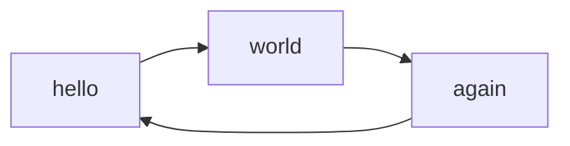

title: Javascript test
obfuscate: Crawler be gone!
encryption_summary: Humans are allowed to press ENTER
encryption_info_message: This page is just obfuscated to counter web crawlers.
inject_id: inject

These tests demonstate the correct execution of [Javascript extensions](../features/jsext.md)

//// html | div#inject

## highlight.js

```bash
#!/bin/bash
echo "Hello World"
```

## arithmatex

\[
v_{e} = \sqrt{\frac{2GM}{d}} = \sqrt{2gd}
\]

## mermaid2



## encrypted javascript

<script id="autostart">

const ctheme = 'css/w3-theme-44bb4f-mono';
document.getElementById('theme-auto').href = base_url + '/' + ctheme + '.css';
document.getElementById('theme-light').href = base_url + '/' + ctheme + '-light.css';
document.getElementById('theme-dark').href = base_url + '/' + ctheme + '-dark.css';

//https://stackoverflow.com/questions/30747235/javascript-pi-%CF%80-calculator
function * generateDigitsOfPi() {
    let q = 1n;
    let r = 180n;
    let t = 60n;
    let i = 2n;
    while (true) {
        let digit = ((i * 27n - 12n) * q + r * 5n) / (t * 5n);
        yield Number(digit);
        let u = i * 3n;
        u = (u + 1n) * 3n * (u + 2n);
        r = u * 10n * (q * (i * 5n - 2n) + r - t * digit);
        q *= 10n * i * (i++ * 2n - 1n);
        t *= u;
    }
}

// Demo
let iter = generateDigitsOfPi();

let output = document.getElementById("pioutput");
let cnt = 200;

(function displayTenNextDigits() {
    let digits = "";
    for (let i = 0; i < 10; i++) digits += iter.next().value;
    output.insertAdjacentHTML("beforeend", digits);
    scrollTo(0, document.body.scrollHeight);
    if (cnt > 0) {
        cnt--;
        requestAnimationFrame(displayTenNextDigits);
    }
})();
</script>


/// html | div#pioutput
    attrs: {style: 'word-wrap:break-word; font-family: monospace'}

///

////